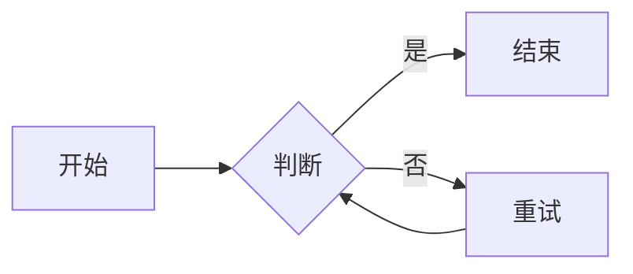
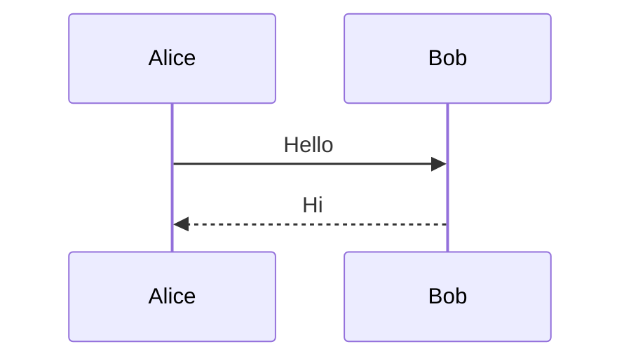

[toc]

# Typora 语法对照测试

对照 [Typora Markdown 语法](https://support.typoraio.cn/zh/Markdown-Reference/) 逐项验证。

## 段落与换行

第一段文字。

第二段文字（空行分隔）。

## 引用

> 单层引用
>
> > 嵌套引用

## 列表

- 无序 A
- 无序 B

1. 有序一
2. 有序二

- [x] 任务完成
- [ ] 任务待办

## 围栏代码块

```javascript
function hello() {
  console.log('hello');
}
```

## 数学公式

行内公式 $E = mc^2$，以及 $\lim_{x \to \infty} e^{-x} = 0$。

$$
\mathbf{V}_1 \times \mathbf{V}_2 = \begin{vmatrix}
\mathbf{i} & \mathbf{j} & \mathbf{k} \\
\frac{\partial X}{\partial u} & \frac{\partial Y}{\partial u} & 0 \\
\frac{\partial X}{\partial v} & \frac{\partial Y}{\partial v} & 0
\end{vmatrix}
$$

## 表格

| 左对齐 | 居中 | 右对齐 |
| :----- | :--: | -----: |
| A      | B    |    100 |

## 脚注

带脚注[^note]的句子。

[^note]: 脚注正文，支持 *斜体* 与 **粗体**。

## 分隔线

---

## 链接

[内联链接](https://example.com)

[参考链接][ref-id]

[ref-id]: https://example.org "可选标题"

文档内跳转：[段落与换行](#段落与换行)

自动链接：<https://typora.io> 与 <i@typora.io>

## 图片语法


## 强调与代码

*斜体* **粗体** ~~删除线~~ `行内代码`

## Typora 扩展（项目增强）

==高亮== H~2~O E=mc^2^

:smile: :rocket: :heart:

## HTML

<u>下划线</u>

<span style="color: red;">红色文字</span>

<video src="example.mp4"></video>

## Mermaid 图表





## GFM Alerts（GitHub 扩展，非 Typora 原生）

> [!NOTE]
> 提示信息
